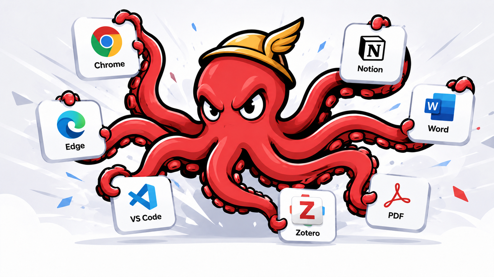

# Hermes

Hermes 是一个 Windows 全局 AI 划词翻译助手。选中英文内容后，按快捷键或点击悬浮按钮，就能把结果以轻量浮窗的形式翻译成简体中文。

<p align="center">
  
</p>

## 适合谁

- 经常在浏览器、PDF、VS Code、Notion、Slack、Word 等软件里阅读英文内容的人。
- 希望不复制、不切窗口、不打开网页翻译器，就能快速理解一段英文的人。
- 希望默认即用腾讯交互翻译（Transmart），并按需切换到 OpenAI 的人。

## 功能亮点

- 全局快捷键翻译，默认 `Ctrl+Alt+E`。
- 先按住 `Ctrl` 再划词会显示悬浮翻译按钮并执行翻译；鼠标和键盘松开顺序不限，普通划词不会触发。
- 先按住 `Alt` 再划词会使用同一悬浮按钮触发术语解释（可配置“解释个性化偏好”）。
- 翻译结果以悬浮卡片显示，支持复制、重新翻译、固定、关闭和拖动。
- 翻译卡片和设置窗口支持从边缘/四角调整大小并自动记忆；悬浮按钮图标大小和浮窗字号都可在外观页通过五点横向控件选择，图标预览会随浅色/深色主题切换且保持透明背景。
- 默认使用腾讯 Transmart 翻译；可切换 OpenAI / OpenAI-compatible。
- OpenAI 模式支持 Responses API 流式输出，译文会边生成边显示。
- 支持 OpenAI-compatible Base URL 和自定义模型名。
- API Key 使用 Windows DPAPI 加密保存在本机。
- 支持浅色、深色和跟随系统主题。
- 默认不保存翻译历史，隐私优先。
- 设置最右侧提供“应用”中心；首个内置应用 `Codex 认证管理` 可通过官方浏览器流程初始化 ChatGPT 登录、保存 ChatGPT / API 两套完整认证档案，一键切换认证并对齐本地 Codex 会话索引。

## 下载和运行

正式对外发布时，请在 GitHub Releases 中下载：

```text
Hermes-v0.3.0-win-x64-portable.zip
```

解压后运行：

```text
Hermes.Windows.exe
```

这是 `win-x64 self-contained` portable 包，目标机器不需要额外安装 .NET Runtime。

如果你是从源码构建，当前本机验证包位于：

```text
artifacts\publish\Hermes.Windows\manual-test\win-x64-self-contained\
```

## 快速开始

1. 启动 `Hermes.Windows.exe`。
2. 在系统托盘中打开 Hermes 设置。
3. 默认 Provider 为 Transmart，可直接使用；如需 OpenAI 再填写 API Key / Base URL / Model。
4. 选中一段英文文本，按 `Ctrl+Alt+E` 翻译。
5. 或先按住 `Ctrl`，再划选英文文本，松开鼠标/键盘后点击出现的悬浮翻译图标。
6. 先按住 `Alt`，再划选术语，松开鼠标/键盘后点击悬浮按钮查看解释。

### Codex 认证管理

1. 打开“设置 → 应用 → Codex 认证管理”。
2. 如果这台电脑当前只有 API 登录，先点击 ChatGPT 卡片中的“浏览器登录”；Hermes 会调用官方 `codex login` 打开浏览器，认证成功后自动保存 ChatGPT 档案、切换认证并同步本地会话。若已在 Codex 中使用 ChatGPT 登录，也可点击“保存当前登录”。
3. API 登录在“配置”中直接编辑中转站提供的完整 `config.toml` 与 `auth.json`，然后使用设置窗口右下角“确定保存”。已保存的 auth 会在本次编辑期间解密回显，便于确认和修改。
4. 浏览器登录、切换或单独同步前，完全退出 Codex 桌面端、CLI、ChatGPT 和使用 Codex 的 IDE 扩展。
5. 点击目标认证方式；Hermes 会先备份，以当前 `.codex/config.toml` 为基础递归合并目标配置、整体替换 `.codex/auth.json`，同步 rollout 和权威 `state_5.sqlite`，最后读回校验。

浏览器登录依赖 Codex 官方运行程序，但不要求单独安装 CLI：Hermes 会依次查找 PATH、npm 安装目录以及 VS Code / VS Code Insiders / Cursor / Windsurf 中官方 Codex 扩展自带的程序。账号密码只在 OpenAI 官方浏览器认证页中输入，Hermes 不读取登录输出，也不记录 token；为了让 CLI 与 IDE 扩展共享同一份认证，登录时会把 `cli_auth_credentials_store` 设置为 `file` 并校验 `%CODEX_HOME%\auth.json`。

认证卡片只显示与当前状态相关的操作：当前使用 ChatGPT 且尚无档案时显示“保存当前登录”和“重新登录”；档案建立后，当前 ChatGPT 卡片只保留真正会重新认证的“重新登录”，认证档案会在之后切换离开 ChatGPT 时自动刷新；尚未建立 ChatGPT 档案且当前使用 API 时以“浏览器登录”为主操作；已有档案且当前使用 API 时显示“切换到 ChatGPT”。不可执行或可由切换流程自动完成的操作不会继续占位。

这里的“同步”是让两种认证都能在同一个本机 Codex 会话列表中看到既有记录：它只重映射本地 Provider 元数据，不把会话上传到 ChatGPT 网页。状态页会把 rollout 总数拆分为常规会话、内部子代理和已归档会话，说明为什么文件数可能大于历史列表数。跨认证会话中的加密内容仍可能因归属不同而无法继续。

API 档案不再固定使用 `OpenAI`。Hermes 从粘贴的 `config.toml` 根配置读取 `model_provider`，保留中转站给出的模型、地址、Provider 定义和其他内容；切换时目标配置中已有的同路径值会替换、新值会加入，目标没有声明的 MCP、插件、项目和其他本机配置保持不变。Provider 标识严格区分大小写，例如 `OpenAI` 与 `openai` 不会被视为同一个 Provider。`auth.json` 在档案中始终以当前 Windows 用户的 DPAPI 加密存储，只在打开编辑器时解密回显，并在保存、返回应用列表或关闭设置窗口后立即从编辑框清除。当前已经使用 API 认证时，右下角保存会同时更新活动 `.codex/config.toml` 与 `.codex/auth.json`、保留未被目标档案声明的 MCP 等本机配置并对齐会话 Provider；应用失败会恢复保存前状态。当前使用 ChatGPT 时则只更新 API 档案，供下次切换使用。

默认 Base URL：

```text
https://transmart.qq.com/api
```

默认模型：

```text
normal
```

说明：术语解释（`Alt` 划词）固定走 OpenAI 通道，请在“AI解释”区域配置 OpenAI API。

## 使用边界

Windows 上不同应用暴露选区的方式并不一致，所以 Hermes 采用多层策略：

1. 优先通过 Windows UI Automation 读取当前选区。
2. 支持用快捷键稳定触发翻译。
3. 在显式触发时，必要情况下使用受控剪贴板兜底。

受控剪贴板兜底只接受本次 `Ctrl+C` 产生的新内容：Hermes 会验证剪贴板确实发生更新，并在完成后恢复原剪贴板；如果没有读到新文本，不会拿之前复制过的残留内容去翻译。

这意味着：Chrome、Edge、VS Code、记事本、PDF 阅读器、办公软件等主流应用会尽量提供顺滑体验；少数应用可能需要使用快捷键或托盘中的“翻译剪贴板”。

## 隐私说明

- 只有用户主动按快捷键、点击悬浮按钮或选择翻译剪贴板时，Hermes 才会发送文本。
- API Key 不写入 `settings.json`，而是使用 Windows DPAPI 加密保存。
- Codex 的完整 config + auth 档案同样使用当前 Windows 用户的 DPAPI 加密，保存在 `%LOCALAPPDATA%\Hermes\apps\codex-auth-switch-sync\`；不会随电脑同步，每台电脑需分别初始化。
- 翻译历史默认关闭。
- 日志默认不记录完整原文和译文，也会脱敏 API Key 形态的内容。
- 可在设置中维护排除应用和敏感应用列表。

## 从源码构建

项目目标框架是 `net10.0-windows`。构建脚本会依次查找 `C:\Code\Env\dotnet`、`D:\Code\Env\dotnet` 和 `PATH` 中的 SDK；也可以显式设置：

```powershell
$env:HERMES_DOTNET_ROOT = "D:\Code\Env\dotnet"
```

常用命令：

```powershell
powershell -ExecutionPolicy Bypass -File scripts\Restore-Hermes.ps1
powershell -ExecutionPolicy Bypass -File scripts\Test-Hermes.ps1
powershell -ExecutionPolicy Bypass -File scripts\Publish-Hermes.ps1
```

生成 GitHub Release portable zip：

```powershell
powershell -ExecutionPolicy Bypass -File scripts\Package-HermesRelease.ps1 -Version 0.3.0
```

输出位置：

```text
artifacts\release\v0.3.0\
```

其中包含：

- `Hermes-v0.3.0-win-x64-portable.zip`
- `checksums.txt`

## GitHub Release 流程

1. 运行测试：`scripts\Test-Hermes.ps1`
2. 生成 zip：`scripts\Package-HermesRelease.ps1 -Version 0.3.0`
3. 创建 tag：`v0.3.0`
4. 在 GitHub Releases 上传 zip 和 `checksums.txt`
5. 把 `docs/release-notes/v0.3.0.md` 的内容作为 Release Notes

> 目前 Hermes 还没有代码签名证书。Windows SmartScreen 可能会提示未知发布者，这是独立 Windows 应用早期发布时常见的情况。

## 项目文档

- `UI.md`：Hermes 的界面设计原则、视觉系统和组件规范。
- `Design.md`：项目结构、核心流程、模块职责、打包策略和变更记录。
- `docs/release-notes/`：GitHub Release 文案草稿。
- `docs/prompts/`：README 头图等视觉素材提示词。

## Provider Notes (2026-05-29)

- Translation settings now use a dual-channel layout: `AI翻译` configures Tencent Transmart, and `AI解释` keeps OpenAI configuration with a `翻译走 OpenAI` toggle.
- Explanation mode always uses OpenAI.
- Translation mode uses OpenAI only when `翻译走 OpenAI` is enabled; otherwise it uses Transmart.
- Legacy single-provider settings are migrated automatically on load.
- Legacy provider migration is only applied when `UseOpenAiForTranslation` is missing from saved settings (old schema), so manual toggle changes are not overwritten.
- Popup loading text now exposes the active channel at runtime and keeps that channel visible during streaming or long-running states:
  - `正在翻译 (Tencent)...` for Transmart translation.
  - `正在翻译 (<OpenAI model>)...` for OpenAI translation.
